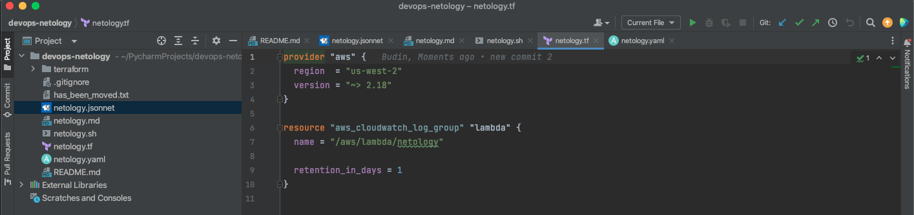
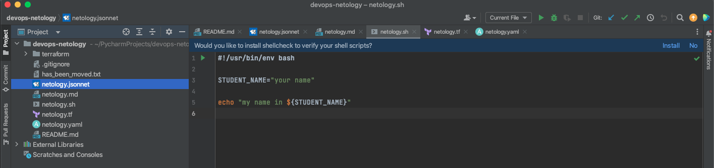
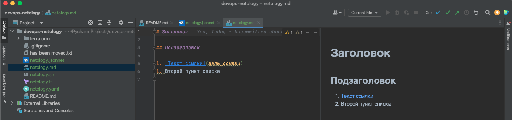
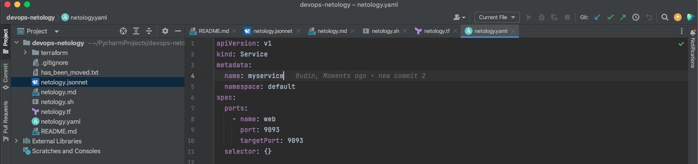
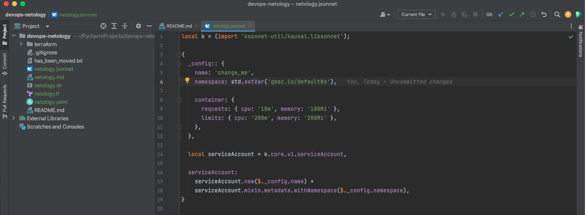

# Домашнее задание к занятию "Введение в DevOps"

### Цель задания

1. Научитесь настраивать окружение для работы
2. Опишите процесс решения задачи в соответствии с жизненным циклом разработки ПО

### Инструкция к заданию

Домашнее задание выполните в файле readme.md в своём репозитории в github или в Google Doc.

1. Сделайте копию [Шаблона для домашнего задания](https://docs.google.com/document/d/1youKpKm_JrC0UzDyUslIZW2E2bIv5OVlm_TQDvH5Pvs/edit) себе на Google Disk.
2. В названии файла введите корректное название лекции и вашу фамилию и имя.
3. Зайдите в “Настройки доступа” и выберите доступ “Просматривать могут все в Интернете, у кого есть ссылка”.
   Ссылка на инструкцию [Как предоставить доступ к файлам и папкам на Google Диске](https://support.google.com/docs/answer/2494822?hl=ru&co=GENIE.Platform%3DDesktop)
4. Выполните домашнее задание, запишите ответы и приложите необходимые скриншоты в свой Google Doc.
5. Для проверки домашнего задания преподавателем отправьте ссылку на ваш документ в личном кабинете.
6. Любые вопросы по решению задач задавайте в чате учебной группы.

### Инструменты и дополнительные материалы, которые пригодятся для выполнения задания

1. [Py Charm Community Edition](https://www.jetbrains.com/ru-ru/pycharm/download/)
2. [Visual Studio Code](https://code.visualstudio.com/Download)

---

## Задание 1. Подготовка рабочей среды

Вы пришли на новое место работы или приобрели новый компьютер.
Первым делом надо настроить окружение для дальнейшей работы.

1. Установить [Py Charm Community Edition](https://www.jetbrains.com/ru-ru/pycharm/download/) - это бесплатная версия IDE.
   В качестве альтернативы можно установить [Visual Studio Code](https://code.visualstudio.com/Download) и дальнейшие шаги проделать с ним. Таким образом вы сможете выбрать для себя более удобный инструмент.

   Далее для примера будут приведены скриншоты из PyCharm.
2. Установить плагины:

   - Terraform,
   - MarkDown,
   - Yaml/Ansible Support,
   - Jsonnet.
3. Склонировать текущий репозиторий (команда `git clone`) или просто создать файлы для проверки плагинов:

   - [netology.tf](netology.tf) – terraform,
   - [netology.sh](netology.sh) – bash,
   - [netology.md](netology.md) – markdown,
   - [netology.yaml](netology.yaml) – yaml,
   - [netology.jsonnet](netology.jsonnet) – jsonnet.
4. Убедитесь, что работает подсветка синтаксиса, файлы должны выглядеть вот так:

   - Terraform
   - Bash
   - Markdown
   - Yaml
   - Jsonnet

*В качестве выполненного задания приведите скриншоты установленной IDE с плагинами в файле readme.md собственного репозитория в GitHub или в Google Doc*

---

*Ответ:*

1, 2 - установлена  PyCharm CE  и соотвествующие плагины

3. склонированы плагины для проверки синтаксиса
4. Terraform

Bash

Markdown

Yaml

Jsonnet

## Задание 2. Описание жизненного цикла задачи (разработки нового функционала)

Чтобы лучше понимать предназначение дальнейших инструментов, с которыми нам предстоит работать, давайте
составим схему жизненного цикла задачи в идеальном для вас случае.

### Описание истории

Представьте, что вы работаете в стартапе, который запустил интернет-магазин. Ваш интернет-магазин достаточно успешно развивался, и вот пришло время налаживать процессы: у вас стало больше конечных клиентов, менеджеров и разработчиков.Сейчас от клиентов вам приходят задачи, связанные с разработкой нового функционала. Задач много, и все они требуют выкладки на тестовые среды, одобрения тестировщика, проверки менеджером перед показом клиенту. В случае необходимости, вам будет необходим откат изменений.

### Решение задачи

Вам необходимо описать процесс решения задачи в соответствии с жизненным циклом разработки программного обеспечения. Использование какого-либо конкретного метода разработки не обязательно. Для решения главное - прописать по пунктам шаги решения задачи (релизации в конечный результат) с участием менеджера, разработчика (или команды разработчиков), тестировщика (или команды тестировщиков) и себя как DevOps-инженера.

*Ответ приведите в свободной форме*

---

*Ответ:*

1. Анализ требований нового функционала для сайта ИМ и постановка задачи – менеджер, аналитик
2. Разработка кода нового функционала - разработчик
3. Тестирование - тестировщик
4. Отладка в случае выявления ошибок на стадии тестирования - разработчик
5. Регулярное создание резервных копий, в том числе, перед внедрением нового функционала - DevOps
6. Развертывание сайта с новыми функциями - DevOps